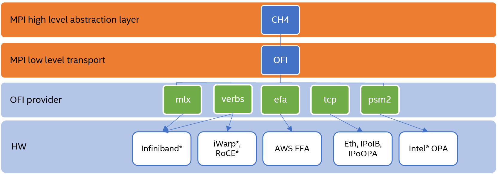

# The Message Passing Interface (MPI) Handbook

A practical guide to the utilization of common Message Passing Interface (MPI) runtimes.

## Table of Contents
1. [MPI Component Hierarchy](#component-heirarchy)
2. [ABI Compatibility Initiative](#abi-compatability)
3. [A Note On Portability](#portability)
4. [MPICH](#mpich)
5. [Open MPI (HPC-X)](#openmpi)

## MPI Component Hierarchy 
This section describes how the different elements of the MPI stack fit together.  The following is an example of the 
MPI component hierarchy found in Intel MPI, however the general stack composition is shared among different MPI 
implementations:

### High Level Abstraction Layer

This layer acts as an interface between the programmer calling MPI functions and the network architecture.  It manages 
peer processes and accommodates lower-level communication models via the data it passes to the network layer.

Modules like CH4 can also provide a fallback communication method such as shared memory. For example, when an MPI 
application is running on a single machine and calls a function like MPI_Send, the high-level abstraction layer can 
handle the transfer of data itself using shared memory. If a more complex configuration is in use, such as when running 
a multi-node job, the high-level abstraction layer will hand the data off to the low-level transport layer.

### Low Level Transport Layer
The low-level transport layer acts as a bridge between the MPI application and the communication fabric. It abstracts 
away the transport and hardware implementation details from the MPI software that runs on top of it and facilitates 
interfacing with a variety of different hardware drivers.

There are currently two common low-level abstraction layer implementations that can be incorporated within an MPI 
implementation: OpenFabrics Interfaces (OFI, also referred to as Libfabric) and Unified Communication X (UCX).

Among popular pre-compiled MPI implementations, OFI is currently used within Intel MPI, while UCX is used within 
NVIDIA’s HPC-X. However, low-level transport layers are not tied to one specific implementation of MPI or another, as 
it is possible to build open-source versions of MPI such as Open MPI and MPICH using either or both of UCX and OFI.

### Low Level Transport Layer Provider
The low-level transport layer provider determines which driver and hardware interface will be used in the MPI 
communication. This can typically be selected at runtime based on the available hardware. For example, a job might use 
the TCP OFI provider when running over Ethernet, the PSM2 provider when using Omni-Path, or the MLX provider when 
using Infiniband.

## ABI Compatability Initiative 
MPI implementations that maintain ABI compatibility are interchangeable at link and run time. For example, one could 
link their software to the MPI library provided by Intel MPI, and then run it with the MPICH runtime, or vice-a-vers. 
The following MPI implementations are ABI compatible:

* MPICH
* Intel® MPI Library
* Cray MPT
* MVAPICH2
* Parastation MPI
* RIKEN MPI

## A Note On Portability 
It can often be tricky to build an implementation of MPI from scratch that can be easily used on a different system 
from the one where it was built.  During the configuration process of most open-source MPI implementations, libraries 
pertaining to the network devices of the given machine will be picked up.  Differences in driver versions at configure 
and runtime, or even differences in the version of pre-requisites for those libraries can cause failures at runtime.  

While it is certainly not impossible to build a highly portable implementation of MPI, it is worth noting that it can 
present a challenge.  Therefore, it is recommended to build an MPI implementation on the same cluster partition 
where it is intended to be run.  If portability is desired, a precompiled MPI package such as 
[Intel MPI](https://www.intel.com/content/www/us/en/developer/tools/oneapi/mpi-library.html#gs.yzy7io) or 
[HPC-X](https://developer.nvidia.com/networking/hpc-x) could be a good option.

## MPICH 
[MPICH](https://www.mpich.org) is a highly customizable, open-source, ABI compatible MPI implementation.  This section 
provides and example of the process to configure and build MPICH, as well as useful runtime options and tips.

### Building
For the purpose of this exercise, a highly versatile version of MPICH-4.0.2 will be built which contains both of the 
common low-level transport layers (OFI and UCX), as well as Slurm queueing support.  The target machine is running EL 
7.8.

#### Acquire Pre-Requisites
Install Slurm and various transport provider pre-requisites using the CentOS 7.8 package manager:

<pre><code>yum install verbs slurm slurm-devel rdmacm infinipath-psm infinipath-psm-devel libibverbs libpsm2 libpsm2-devel librdmacm rdma-core-devel fuse3-devel fuse3-libs numactl-devel numactl-libs</code></pre>

##### Acquire UCX
An experiment was conducted to build UCX from scratch, however this ultimately resulted in unavailable protocol and 
transport errors at runtime.  The MPICH developers were consulted and one of them remarked, "UCX often needs to be 
configured on the compute node to be properly configured."  Therefore, it is recommended to use the version of UCX 
provided by the system's network adapter drivers, for example, 
[MLNX_OFED](https://network.nvidia.com/products/infiniband-drivers/linux/mlnx_ofed/) if using a Mellanox Infiniband 
adapter.

For more on this topic, please see [the note on portability.](#portability)

##### Acquire Libfabric
Libfabric was acquired using the CentOS 7.8 package manager:
<pre><code>yum install libfabric libfabric-devel</code></pre>

#### Build MPICH
* Download and extract [MPICH source](https://www.mpich.org/downloads/)
* On the machine used during this exercise, it was necessary to create the following symbolic link for the 
configure script to find the system's Libfabric:
<pre><code>ln -s /usr/lib64/libpsm_infinipath.so.1.16 /usr/lib64/libpsm_infinipath.so</code></pre>
* Configure and build MPICH:
<pre><code>./configure --prefix=/your/desintation/path --with-libfabric --with-ucx=embedded --with-slurm --enable-shared --with-device=ch4:ofi,ucx</code></pre>
<pre><code>make -j 16 && make install</code></pre>

### MPICH Utilization - Useful Options
The following options represent a set of common options in the day-to-day usage of MPICH:

* HYDRA_TOPO_DEBUG=1

Displays process binding information.  Must be used in conjunction with the mpirun/mpiexec parameter "-bind-to" (e.g. 
-bind-to core), as process pinning is not enabled by default in MPICH.
* MPIR_CVAR_DEBUG_SUMMARY=1

Displays the available low-level transport providers

* FI_PROVIDER=<provider>

Select one of the OFI providers listed by MPIR_CVAR_DEBUG_SUMMARY

* MPIR_CVAR_CH4_NETMOD=ucx

Selects the UCX low-level transport instead of OFI

* UCX_NET_DEVICES=mlx5_0:1

When using UCX, select the Mellanox network adapter.  Available adapters can be listed by running "ucx_info -d".

* UCX_TLS=<transport>

Select the UCX transport.  Available transports are listed with "ucx_info -d".

## Open MPI (HPC-X)

[HPC-X](https://developer.nvidia.com/networking/hpc-x) is a pre-compiled version of Open MPI distributed by NVIDIA 
(formerly Mellanox).  In addition to Open MPI, HPC-X contains several other packages such as those that enable 
in-network computing.

### Rebuilding Open MPI with Libfabric

Difficulty was encountered running the standard UCX-equipped Open MPI contained in HPC-X on an OmniPath cluster.  For 
the purpose of this exercise, the version of Open MPI distributed in HPC-X was rebuilt using Libfabric instead of UCX.  
The was done with the following configure parameters:

<pre><code>./configure --prefix=/path/to/destination --disable-ipv6 --with-slurm --with-pmi --with-ofi --with-psm --with-psm2=/path/to/usr/psm2 --with-verbs --without-usnic</code></pre>

On the configuration used in this exercise, it was necesarry to build libnuma as a prerequisite to building the psm2 
library.

### Open MPI terminology differences and low level transport controls

Open MPI uses different terminology for the MPI component stack described 
[in the first section of this article.](#component-heirarchy)

There is not a precise equivalence between the hierarchy of Intel MPI/MPICH, rather the structure can be more accurately 
described in terms of a rough equivalence.  

The PML (point-to-point layer) in Open MPI can be thought of as the low-level transport layer.  This can be controlled 
with mpirun parameters, for example, adding the following flag selects the UCX PML:

<pre><code>--mca pml ucx</code></pre>

